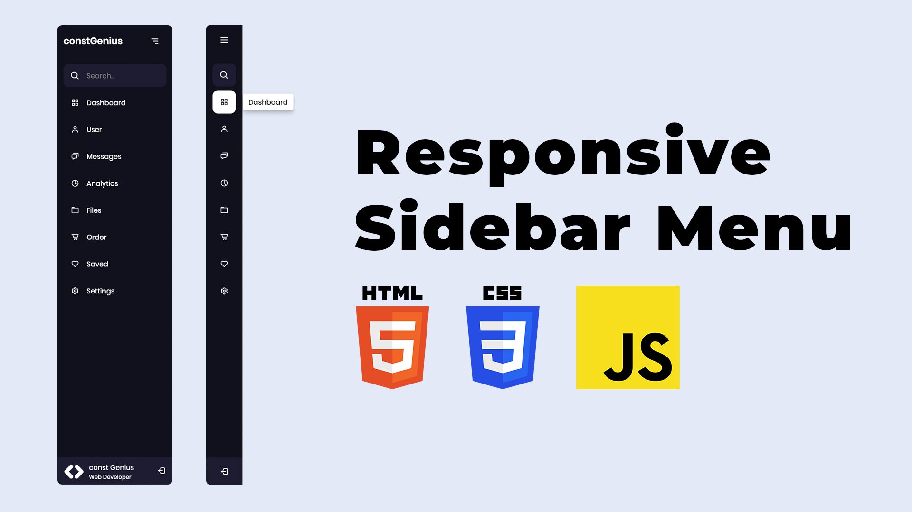

# Responsive Side Navigation Bar Using HTML CSS and JavaScript | Dashboard Sidebar Menu

The Responsive Sidebar Menu tutorial offers a comprehensive guide to creating a dynamic and user-friendly sidebar menu for web applications using HTML, CSS, and JavaScript. This project focuses on building a dashboard sidebar menu that seamlessly adapts to different screen sizes, ensuring a consistent and intuitive navigation experience across devices.

Youtube Tutorial Link: https://youtu.be/MpVvNCEVcuc

By leveraging HTML for structure, CSS for styling, and JavaScript for interactivity, developers can learn essential techniques for creating responsive user interfaces. This tutorial covers topics such as media queries, flexbox layout, and event handling to enable smooth transitions and interactive features in the sidebar menu.

Overall, the Responsive Sidebar Menu project provides valuable insights into front-end web development practices, empowering developers to enhance the usability and accessibility of their web applications with a responsive sidebar menu.
